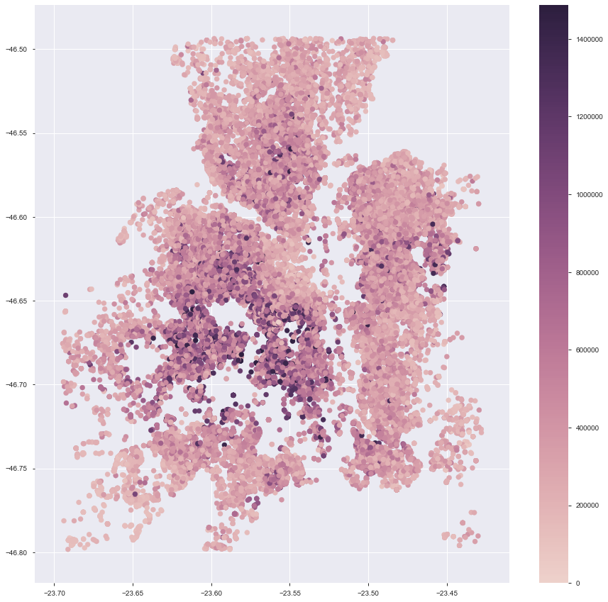
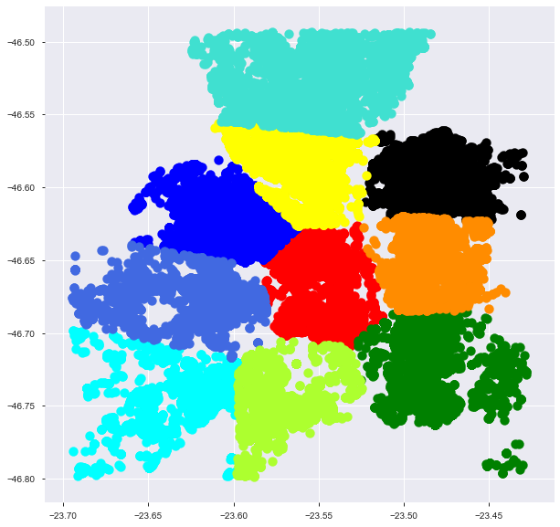
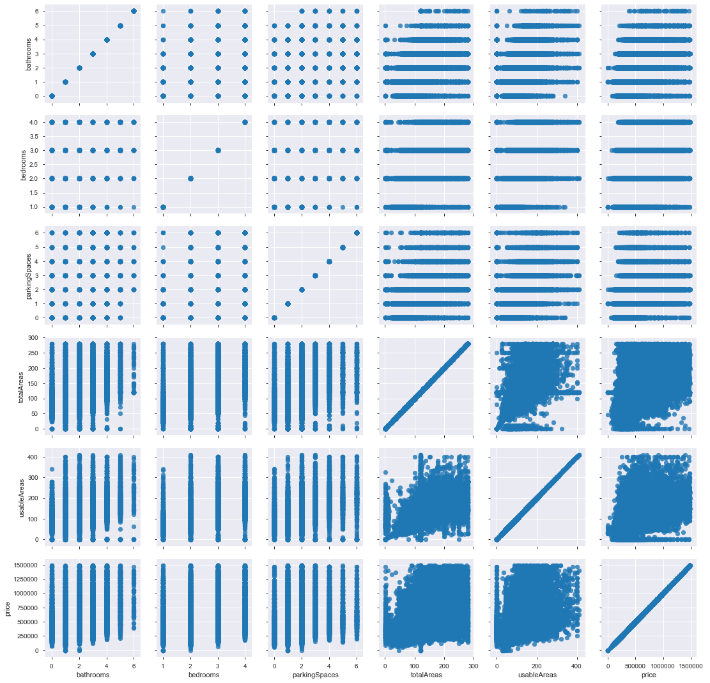
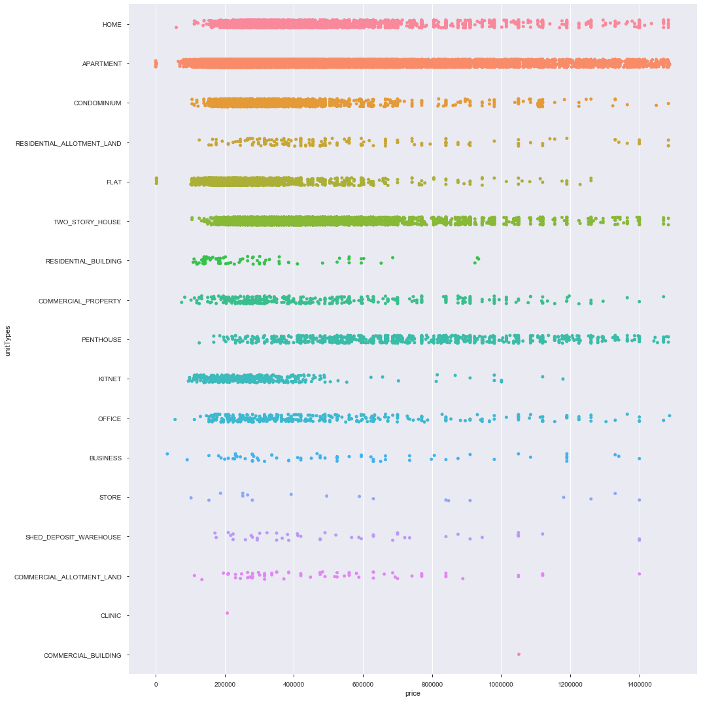
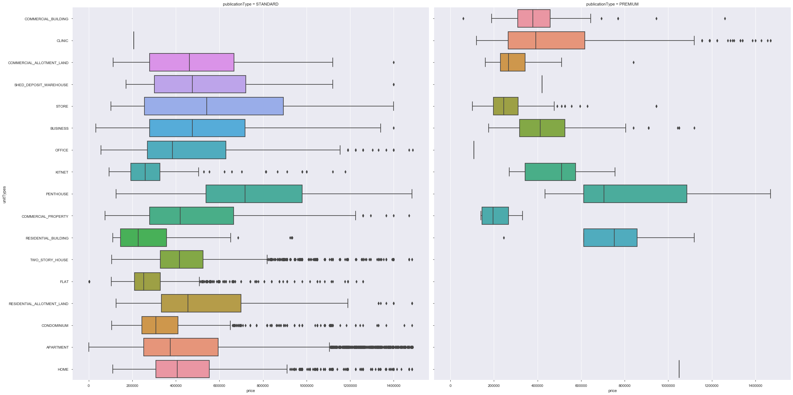
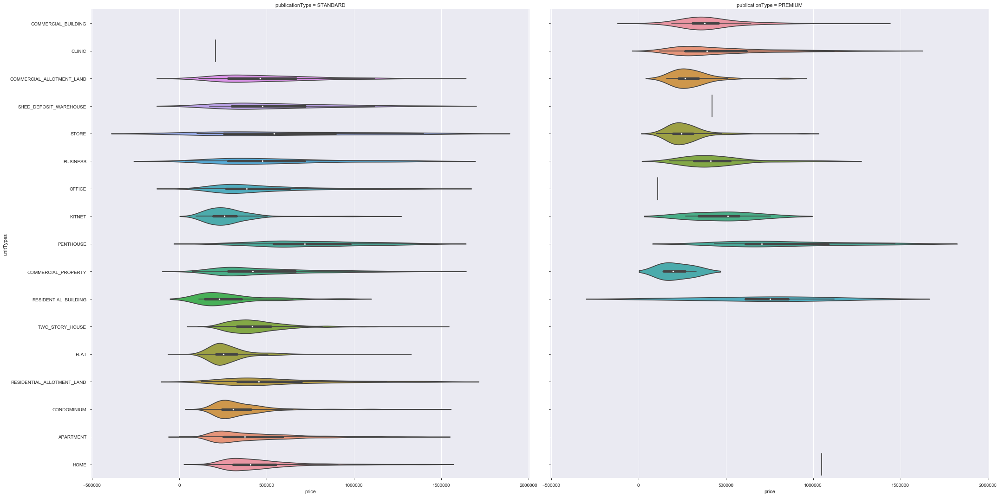
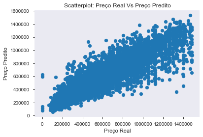
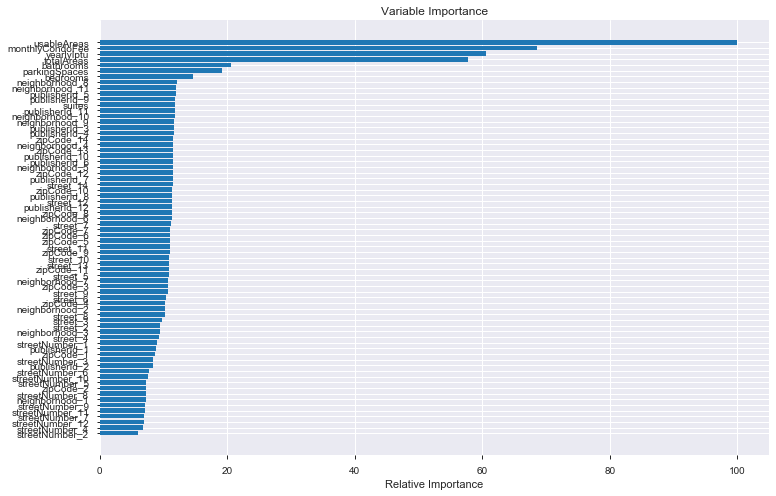
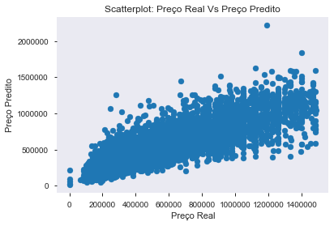
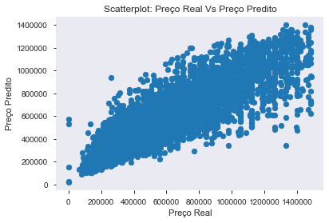

  

# Desafio-Zap


Olá. O objetivo deste projeto é realizar análises descritivas, visuais e preditivas sobre dados de locações imobiliárias utilizando exclusivamente a linguagem Python.

Apesar da minha experiência anterior ter sido com trabalhos na linguagem R, assumi o desafio de desenvolver uma solução (em uma linguagem que recentemente comecei a trabalhar e aprender, através de cursos online) para o problema proposto pelo Grupo Zap. 

O projeto contém o diretório csv, com os arquivos com os resultados das predições.
O diretório images contém as imagens geradas neste tutorial.
O diretório py contém o código fonte deste tutorial, com comentários incluídos.
O diretório json deveria conter os arquivos de treinamento e teste, porém por limitações do guthub não foi possível inserí-los.

# Importação de bibliotecas necessárias e dos conjuntos de dados

Primeiramente, serão carregados os pacotes/bibliotecas necessárias do Python para a realização das análises. 
@ json para manipulação de dados no formato json;
@ pandas para manipulação de dataframes
@ skylearn para criação de modelos de aprendizado de máquina (classificadores, regressores, ...)
@ matplotlib.pyplot para criação de gráficos
@ numpy para funções numéricas
@ seaborn para criação de gráficos com estatísticas
@ pandas_profiling para gerar relatórios dinâmicos sobre os dados
@ statistics para geração de estatísticas sobre conjuntos de dados
@ lightgbm e xgboost para criação de modelos de aprendizado de máquina
@ plotly para geração de gráficos interativos
@ category_encoders para codificação de atributos categóricos
@ cufflinks para permitir geração de gráficos no ambiente Jupyter


```python
import json
import pandas as pd
import sklearn as sk
from sklearn import preprocessing, svm
from sklearn import linear_model
from sklearn.preprocessing import StandardScaler
from sklearn.neural_network import MLPRegressor
from sklearn.metrics import mean_squared_error, mean_absolute_error, r2_score
from sklearn.model_selection import cross_val_score, GridSearchCV, train_test_split
from sklearn.cluster import KMeans
from scipy.stats import uniform, randint
import matplotlib.pyplot as plt
import matplotlib.colors as colors
import matplotlib.cm as cmx
import numpy as np
import seaborn as sns
import pandas_profiling
import statistics as stat
import lightgbm as lgb
import xgboost as xgb
%matplotlib inline
import plotly.figure_factory as ff
import plotly.plotly as py
import plotly.graph_objs as go
import plotly.offline as poff
import category_encoders as ce
from plotly.offline import iplot, init_notebook_mode, download_plotlyjs, plot
import cufflinks as cf
cf.go_offline()
cf.set_config_file(offline=False, world_readable=True)
```

Agora será realizada a importação dos dados em formato json. Localmente, foi criado um diretório raiz com a pasta json e nela estão contidos os arquivos com os dados de treinamento e teste necessários para as análises. Não foi possível inserir os arquivos no github por limitações de tamanho.
Cabe mencionar que foi necessário utilizar o argumento **encoding** devido à presença de acentos e demais símbolos no arquivo. O argumento **Lines** foi utilizado para poder ler com sucesso arquivos json separados por linhas.


```python
df = pd.read_json("json/source-4-ds-train.json", encoding = "utf-8", lines = True)
df_teste = pd.read_json("json/source-4-ds-test.json", encoding = "utf-8", lines = True)
```

# Pré-processamento dos dados 

Aproveitamos a oportunidade para visualizar o que temos de dados e atributos no dataframe com a função **head** do pandas. Sabemos previamente pela descrição do problema que devemos ter 19 colunas (sendo duas delas compostas de outras informações).


```python
with pd.option_context('display.max_rows', 100, 'display.max_columns', 10, 'display.max_colwidth', -1):
    display(df.info())
```


```python
with pd.option_context('display.max_rows', 100, 'display.max_columns', 10, 'display.max_colwidth', -1):
    display(df_teste.info())
```

Foi observada a necessidade de desaninhar três atributos no formato json: geoLocation (localização geográfica), address (endereço) e pricingInfos (informações de preços). Então foi utilizada a função **concat** para concatenar dois dataframes, o original e um derivado da coluna "address" do original. Para transformar a coluna "address" do dataframe original do formato dict para dataframe foi utilizada a função do pandas **DataFrame.from_records**, utilizando o argumento **axis** como 1 para concatenar os dataframes pelas colunas. O mesmo procedimento foi realizado para o atributo "pricingInfos". Ainda, foram analisados quais registros da coluna **"geoLocation"** eram nulos para realizar o preenchimento com um **dict** vazio. Antes, foram concatenados os dataframes com dados de treinamento e teste (0 - 133964 são dados de treinamento e restante de teste).


```python
df = pd.concat([df, df_teste], axis=0, ignore_index = True) 
```


```python
df = pd.concat([df, pd.DataFrame.from_records(df['address'])], axis=1) 
df = pd.concat([df, pd.DataFrame.from_records(df['pricingInfos'])], axis=1)
df["geoLocation"][df["geoLocation"].isnull()]
df["geoLocation"][53] = {'precision': 'missingvalue', 'location': {'lon': -1, 'lat': -1}}
df["geoLocation"][94] = {'precision': 'missingvalue', 'location': {'lon': -1, 'lat': -1}}
df["geoLocation"][6581] = {'precision': 'missingvalue', 'location': {'lon': -1, 'lat': -1}}
df["geoLocation"][7713] = {'precision': 'missingvalue', 'location': {'lon': -1, 'lat': -1}}
df["geoLocation"][8142] = {'precision': 'missingvalue', 'location': {'lon': -1, 'lat': -1}}
df["geoLocation"][9425] = {'precision': 'missingvalue', 'location': {'lon': -1, 'lat': -1}}
df["geoLocation"][9454] = {'precision': 'missingvalue', 'location': {'lon': -1, 'lat': -1}}
df["geoLocation"][11577] = {'precision': 'missingvalue', 'location': {'lon': -1, 'lat': -1}}
df["geoLocation"][11778] = {'precision': 'missingvalue', 'location': {'lon': -1, 'lat': -1}}
df["geoLocation"][11944] = {'precision': 'missingvalue', 'location': {'lon': -1, 'lat': -1}}
df["geoLocation"][14326] = {'precision': 'missingvalue', 'location': {'lon': -1, 'lat': -1}}
df["geoLocation"][139729] = {'precision': 'missingvalue', 'location': {'lon': -1, 'lat': -1}}
df["geoLocation"][139876] = {'precision': 'missingvalue', 'location': {'lon': -1, 'lat': -1}}
df["geoLocation"][145651] = {'precision': 'missingvalue', 'location': {'lon': -1, 'lat': -1}}
```

Agora, realizamos um desmembramento da coluna de geolocalização para três novas colunas no dataframe original: **precision**, **lat** e **long** (atributos já existentes na coluna **geoLocation**, porem em um formato inadequado).


```python
L = []
L2 = []
for i in range(0,df.shape[0]):
    L.append(df["geoLocation"][i]["precision"])
    L2.append(df["geoLocation"][i]["location"])
Ldf = pd.DataFrame(L, columns=['precision'])
L2df = pd.DataFrame(L2, columns=['lon','lat'])
df = pd.concat([pd.concat([df, Ldf],axis=1),L2df],axis=1)
```

Agora podemos remover as colunas "address", "pricingInfos" e "geoLocation" com a função **drop**.


```python
df = df.drop("address", axis=1)
df = df.drop("pricingInfos", axis=1)
df = df.drop("geoLocation", axis=1)
```

Agora verificamos os dados após a remoção. 


```python
df.head()
```

Ao verificar as colunas do dataframe com a função **list** e o campo **columns**, foi possível perceber que havia uma coluna adicional, chamada **period**, não mencionada na descrição do problema, que deve tratar da periodicidade do aluguel, quando aplicável.


```python
list(df.columns) 
```

# Dados faltantes

Agora será contabilizado o percentual de registros faltantes por coluna do dataframe e serão definidas estratégias para contornar cada situação. Para isso, e outros feedbacks interessantes sobre os dados, será utilizada a biblioteca **pandas-profiling**.
Tem-se duas situações distintas a serem contabilizadas de forma automática: os casos dos NaN e das strings vazias ''.
O código abaixo realiza a contagem e soma por coluna do número de registros com NaN e '', divide-se pelo número total de registros e multiplica-se por 100 para obter o percentual de dados faltantes por coluna.


```python
percentual = ((df.iloc[0:133964].isnull().sum() + (df.iloc[0:133964] == '').sum())/df.iloc[0:133964].shape[0])*100
df.iloc[0:133964].profile_report(style={'full_width':True})
```

## Casos detectáveis automaticamente

Agora são padronizados os dados faltantes para valores -1 (numéricos) e "missingvalue" (objetos e strings ou outros)


```python
df = df.fillna(-1)
df = df.replace('', "missingvalue")
```

## Casos não detectáveis de forma automática (Strings)

O caso dos dados numéricos foi resolvido. Infelizmente, ainda tem-se os casos que não são detectados de forma automática nas colunas com outros tipos de dados. Então, após realizar as abordagens automáticas, realizamos a checagem dos registros de todas as colunas para encontrar e corrigir registros faltantes e provavelmente incorretos que foram preenchidos manualmente. Para isso, foi utilizado o código abaixo, repetido para cada coluna não-numérica do dataframe. 
Detalhe: foi criada/utilizada a função **replace_all** para substituir conjuntos de strings 
(Fonte: https://stackoverflow.com/questions/6116978/how-to-replace-multiple-substrings-of-a-string).


```python
def replace_all(text, dic):
    for i, j in dic.items():
        text = text.replace(i, j)
    return text
```


```python
mask = (df['description'].str.len() < 10)
df['description'][mask]
d = {'-' : "missingvalue" , "." : "missingvalue" , ".." : "missingvalue", "..." : "missingvalue" , "*" : "missingvalue" , "0" : "missingvalue" , "Aoart" : "missingvalue" , "xx" : "missingvalue" , "e" : "missingvalue" , "g" : "missingvalue" , "MD0943SB" : "missingvalue" , "...." : "missingvalue" , ". ." : "missingvalue" , ". .." : "missingvalue" , "-." : "missingvalue" , ",.." : "missingvalue" , "00" : "missingvalue"}
df['description'] = replace_all(df['description'], d) #atributo com muitos dados incorretos, agora corrigidos
df['listingStatus'].value_counts()
df['publicationType'].value_counts()
df['title'].value_counts()
mask = (df['title'].str.len() < 11)
df['title'][mask]
df['unitTypes'].value_counts()
df['city'].value_counts()
df['country'].value_counts()
df['country'] = df['country'].replace('missingvalue', "BR") # a cidade é São Paulo para 99% todos registros, portanto, o país é conhecido.
df['district'].value_counts() #atributo irrelevante pela quantidade de registros ausentes
df['neighborhood'].value_counts()
mask = (df['neighborhood'].str.len() < 10)
df['neighborhood'][mask].unique()
df['state'].value_counts()
df['state'] = df['state'].replace('SP', "São Paulo")
df['state'] = df['state'].replace('missingvalue', "São Paulo") # a cidade é São Paulo para 99% todos registros, portanto, o estado é conhecido.
df = df[df.state != 'Santa Catarina'] # um único registro de SC é considerado um ruído, já que a base é sobre SP, portanto removemos a amostra
df['street'].value_counts()
mask = (df['street'].str.len() < 11)
df['street'][mask].unique()
df['streetNumber'].value_counts()
df['unitNumber'].value_counts() #atributo irrelevante pela quantidade de registros ausentes
df['zipCode'].value_counts()
mask = (df['zipCode'].str.len() < 8)
df['zipCode'][mask].unique()
df['zone'].value_counts() #atributo relevante, mas com muitos dados faltantes, e redundante com outras informações de localidade do imóvel
df['businessType'].value_counts()
df['period'].value_counts()
```


    -1         120873
    MONTHLY     29104
    DAILY          19
    YEARLY          3
    Name: period, dtype: int64


## Correção dos dados faltantes (numéricos)

Para viabilizar o posterior processo de visualização dos dados, agora são checadas e corrigidos todos os atributos numéricos do dataframe. Para checar o percentual de dados faltantes por coluna, basta visualizar a variável **percentual**. Para valores incorretos ou nulos será utilizada a mediana (função **median**, do pacote **statistics**). Não recomendo utilizar essa abordagem quando os dados faltantes representarem um percentual muito grande das amostras, visto que altera a distribuição e variância dos dados, afetando na precisão dos modelos preditivos gerados. A escolha também foi consolidada devido ao espaço de tempo restante para a realização das analises posteriores. 

Tem-se ainda outras abordagens como:
1- excluir registros.
2- ignorar registros.
3- utilizar a média, mediana ou moda do atributo.
4- inserção dedutiva.
5- inserção utilizando análise de regressão linear.
6- inserção utilizando análise de regressão linear estocástica.
7- inserção com método hot-deck.
8- inserção por máxima verossimilhança

Mais informações sobre o assunto podem ser verificadas no seguinte paper: <https://www.ncbi.nlm.nih.gov/pmc/articles/PMC3668100/>

Para os dados categóricos no formato de string, o próprio dado faltante "missingvalue" será considerado como uma categoria dos atributos.

Para a parte dos dados de teste, utilizou-se o zero como indicação de dado ausente, visando não modificar os dados reais de teste.


```python
df.select_dtypes(['float64']).columns
df.iloc[0:133964]["lat"][df["lat"] > -22] = stat.median(df.iloc[0:133964]["lat"][df.iloc[0:133964]["lat"] < -22])
df.iloc[0:133964]["lon"][df["lon"] > -22] = stat.median(df.iloc[0:133964]["lon"][df.iloc[0:133964]["lon"] < -22])
df.iloc[0:133964]["bathrooms"][df["bathrooms"] == -1] = stat.median(df.iloc[0:133964]["bathrooms"][df.iloc[0:133964]["bathrooms"] != -1])
df.iloc[0:133964]["bedrooms"][df["bedrooms"] == -1] = stat.median(df.iloc[0:133964]["bedrooms"][df.iloc[0:133964]["bedrooms"] != -1])
df.iloc[0:133964]["parkingSpaces"][df["parkingSpaces"] == -1] = stat.median(df.iloc[0:133964]["parkingSpaces"][df.iloc[0:133964]["parkingSpaces"] != -1])
df.iloc[0:133964]["suites"][df["suites"] == -1] = stat.median(df.iloc[0:133964]["suites"][df.iloc[0:133964]["suites"] != -1])
df.iloc[0:133964]["totalAreas"][df["totalAreas"] == -1] = stat.median(df.iloc[0:133964]["totalAreas"][df.iloc[0:133964]["totalAreas"] != -1])
df.iloc[0:133964]["totalAreas"][df["totalAreas"] == 0] = stat.median(df.iloc[0:133964]["totalAreas"])
df.iloc[0:133964]["usableAreas"][df["usableAreas"] == -1] = stat.median(df.iloc[0:133964]["usableAreas"][df.iloc[0:133964]["usableAreas"] != -1])
df.iloc[0:133964]["yearlyIptu"][df["yearlyIptu"] == -1] = stat.median(df.iloc[0:133964]["yearlyIptu"][df.iloc[0:133964]["yearlyIptu"] != -1])

df.iloc[133964:135001]["bathrooms"][df["bathrooms"] == -1] = 0
df.iloc[133964:135001]["bedrooms"][df["bedrooms"] == -1] = 0
df.iloc[133964:135001]["parkingSpaces"][df["parkingSpaces"] == -1] = 0
df.iloc[133964:135001]["suites"][df["suites"] == -1] = 0
df.iloc[133964:135001]["totalAreas"][df["totalAreas"] == -1] = 0
df.iloc[133964:135001]["usableAreas"][df["usableAreas"] == -1] = 0
df.iloc[133964:135001]["yearlyIptu"][df["yearlyIptu"] == -1] = 0
```

Agora, para as variáveis **monthlyCondoFee** e **rentalTotalPrice**, foi decidido atribuir valor 0 para dados ausentes, já que são atributos específicos de determinadas classes de imóveis e modalidade de locação. Não é a melhor alternativa, mas por restrições de tempo optou-se por tal alternativa (obviamente, isso terá impacto no modelo final).


```python
#df.groupby('unitTypes', as_index=False)['bathrooms'].median()
df["monthlyCondoFee"][df["monthlyCondoFee"] == -1] = 0
df["rentalTotalPrice"][df["rentalTotalPrice"] == -1] = 0
```

Agora os dados são checados novamente após as correções com o **profile_report**.


```python
df.iloc[0:133964].profile_report(style={'full_width':True})
```

# Remoção de outliers (do conjunto treinamento apenas)

Será adotada tal medida para não só facilitar a visualização de dados, mas também reduzir a variância nos dados por amostras em pequeno número. Apesar da maioria dos dados seguirem uma distribuição assimétrica, optamos por esta opção pela simplicidade e tempo restante para desenvolver o restante deste trabalho. Os dados de teste são mantidos em uma variável separada **df_test**.


```python
df_train = df.iloc[0:133964]
df_test = df.iloc[133964:150001]
Q1 = df_train.quantile(0.25)
Q3 = df_train.quantile(0.75)
IQR = Q3 - Q1
df_sem_outlier = df_train[~((df_train < (Q1 - 1.5 * IQR)) |(df_train > (Q3 + 1.5 * IQR))).any(axis=1)]
```

# Visualização dos dados - relação com o preço

A primeira tentativa foi um gráfico de coordenadas paralelas com atributos numéricos normalizados. 
Foi possível identificar alguns padrões de forma clara, como:
Imóveis com mais banheiros tem tendência de um preço maior;
Imóveis com mais quartos tem tendência de um preço maior;
Imóveis com mais área total e utilizável tem tendência de um preço maior;
Imóveis com mais espaços de estacionamento não aparentam ter relação com o preço;


```python
df_clone = df_sem_outlier[['price','bathrooms','bedrooms','parkingSpaces','totalAreas','usableAreas']]
```

```python
data = [
    go.Parcoords(
        line = dict(color = df_clone['price'], colorscale = [[0,'#cc0000'],[0.5,'#ffff66'],[1,'#00cc00']]),
        dimensions = list([
            dict(range = [0,6], label = 'bathrooms', values = df_clone['bathrooms']),
            dict(range = [0,4], label = 'bedrooms', values = df_clone['bedrooms']),
            dict(range = [0,6], label = 'parkingSpaces', values = df_clone['parkingSpaces']),
            dict(range = [0,280], label = 'totalAreas', values = df_clone['totalAreas']),
            dict(range = [0,410], label = 'usableAreas', values = df_clone['usableAreas']),
            dict(range = [0,1487500], label = 'price', values = df_clone['price'])
        ])
    )
]

layout = go.Layout(
    plot_bgcolor = '#FFFFFF',
    paper_bgcolor = '#FFFFFF'
)

fig = go.Figure(data = data, layout = layout)
poff.iplot(fig, filename = 'parcoords-basic')
```

Como estão dispostas as casas de acordo com a localidade geográfica?

```python
cmap = sns.cubehelix_palette(as_cmap=True)
f, ax = plt.subplots(figsize=(15,15))
points = ax.scatter(df_sem_outlier.lat, df_sem_outlier.lon, c=df_sem_outlier.price, s=50, cmap=cmap)
f.colorbar(points)
```



```python
kmeans = KMeans(n_clusters=10)
cluster = pd.DataFrame(pd.concat([df_sem_outlier.lat,df_sem_outlier.lon],axis = 1))
kmeans.fit(cluster)
y_km = kmeans.fit_predict(cluster)
```


```python
plt.figure(figsize=(10,10))
plt.scatter(cluster[y_km ==0].lat, cluster[y_km == 0].lon, s=100, c='red')
plt.scatter(cluster[y_km ==1].lat, cluster[y_km == 1].lon, s=100, c='black')
plt.scatter(cluster[y_km ==2].lat, cluster[y_km == 2].lon, s=100, c='blue')
plt.scatter(cluster[y_km ==3].lat, cluster[y_km == 3].lon, s=100, c='cyan')
plt.scatter(cluster[y_km ==4].lat, cluster[y_km == 4].lon, s=100, c='yellow')
plt.scatter(cluster[y_km ==5].lat, cluster[y_km == 5].lon, s=100, c='green')
plt.scatter(cluster[y_km ==6].lat, cluster[y_km == 6].lon, s=100, c='royalblue')
plt.scatter(cluster[y_km ==7].lat, cluster[y_km == 7].lon, s=100, c='darkorange')
plt.scatter(cluster[y_km ==8].lat, cluster[y_km == 8].lon, s=100, c='greenyellow')
plt.scatter(cluster[y_km ==9].lat, cluster[y_km == 9].lon, s=100, c='turquoise')
```



Como as variáveis numéricas estão correlacionadas?


```python
g = sns.PairGrid(df_sem_outlier, vars=['bathrooms', 'bedrooms', 'parkingSpaces', 'totalAreas', 'usableAreas', 'price'], palette='RdBu_r')
g.map(plt.scatter, alpha=0.8)
g.add_legend();
```


Como o tipo de imóvel se relaciona com o preço?


```python
sns.catplot(x="price",y="unitTypes",data=df_sem_outlier,  height = 15)
```



```python
sns.catplot(x="price", y="unitTypes", kind="box", col="publicationType", data=df_sem_outlier, height = 15);
```



```python
sns.catplot(x="price", y="unitTypes", kind="violin", col="publicationType", data=df_sem_outlier, height = 15);
```



```python
df_sem_outlier.iplot(
    x='totalAreas',
    y='price',
    # Specify the category
    categories='unitTypes',
    xTitle='Preço',
    yTitle='Área Total',
    title='Preço x Área total comparados por tipo de imóvel')
```

# Remoção de atributos

Agora, serão removidas colunas que não deverão agregar valor informativo ao modelo preditivo que será desenvolvido com o comando **drop**. Além disso, utilizar tais atributos tornam a criação do modelo mais onerosa. Esta análise é subjetiva e depende da interpretação do cientista/engenheiro/desenvolvedor. As colunas selecionadas para remoção são: **"createdAt"**, **"images"**, **"title"**,**"updatedAt"**, **"precision"** e **"description"**. OBS: aqui assume-se que o que exerce influência no preço do imóvel não é o título ou a descrição do anúncio, e sim as características íntrinsecas do imóvel. Porém, em um caso real, a descrição e título podem ser analisados separadamente para verificar quais descrições ou títutos de anúncios exercem maior influência nos preços dos imóveis, e assim, direcionar ações de marketing  mais efetivas para o mercado de imóveis. Além das colunas mencionadas, também serão removidas as colunas **"district"**, **zone** e **"unitNumber"** pela quantidade de registros faltantes (maior que 85%). Por fim, serão removidas as colunas **city**, **country**, **state** e **listingStatus** por não terem variância nos dados. **Latitude** e **Longitude** são correlacionadas entre si naturalmente devido à localização geográfica, porem, não serão incluídas nesta análise (é possível posteriormente realizar, por exemplo, uma clusterização destes atributos e substituir estes dois atributos por um único, separados em diversos grupos de localidades). A identificação de cada anuncio também não agrega informação relevante ao modelo preditivo. **locationId** também será removido por ser redundante com outras informações de localidade. Detalhe: dados de treino e teste novamente concatenados, sendo das linhas 0 - 68493 os dados de treinamento.


```python
df_sem_outlier = pd.concat([df_sem_outlier, df_test], axis=0, ignore_index = True) 
df_sem_outlier = df_sem_outlier.drop("createdAt", axis=1).drop("images", axis=1).drop("title", axis=1).drop("updatedAt", axis=1).drop("description", axis=1).drop("district", axis=1).drop("zone", axis=1).drop("unitNumber", axis=1).drop("city", axis=1).drop("country", axis=1).drop("state", axis=1).drop("listingStatus", axis=1).drop("precision", axis=1).drop("id", axis=1).drop("lat", axis=1).drop("lon", axis=1).drop("locationId", axis=1)
```

Agora a coluna **"owner"** é transformada para o tipo numérico. 


```python
df_sem_outlier["owner"] = df_sem_outlier["owner"]*1
```

# Dados categóricos do tipo string

Agora é realizada uma transformação das colunas que são do tipo object (textos) para o tipo numérico, de modo que seja possível utilizá-las nos modelos de aprendizado de máquina. Primeiro é realizada a conversão das colunas do tipo **object** para **category**.


```python
df_sem_outlier[df_sem_outlier.select_dtypes(['object']).columns] = df_sem_outlier.select_dtypes(['object']).apply(lambda x: x.astype('category'))
```

Realiza-se uma cópia do dataframe e agora trabalha-se com essa cópia, para não modificar o original.


```python
df_copy = df_sem_outlier.copy()
```

Agora vamos analisar cada coluna categórica do dataframe cópia. Será utilizado o método **Binary Encoding**. Para realizar tais verificações foi utilizada a biblioteca **pandas-profiling** anteriormente. 
Colunas com **Binary Encoding**: businessType, publicationType, neighborhood, publisherId, street, streetNumber, period, locationId, unitTypes e zipCode.


```python
ce_bin = ce.BinaryEncoder(cols = ['businessType','publicationType','neighborhood','publisherId','street','streetNumber','period','unitTypes','zipCode'])
df_copy = ce_bin.fit_transform(df_copy)
```

# Criação dos modelos: Treinamento e teste

Agora serão realizados os testes com os algoritmos de regressão. Primeiramente será realizada uma divisão entre base de dados de treinamento e de teste. Será utilizada a divisão 75% treinamento e 25% para teste (com os registros da parte do treinamento), com a função **train_test_split**. Também separados o conjunto final dos dados de teste.


```python
variables = df_copy.drop(['price'], axis=1)
X_data = variables.iloc[0:68493]
X_test_final = variables.iloc[68493:84529]
y_result = pd.DataFrame(df_copy['price']).iloc[0:68493]
```


```python
X_train, X_test, y_train, y_test = train_test_split(X_data, y_result, test_size = 0.25)
```

Aqui é realizada uma transformação de normalização/padronização nas variáveis independentes de treinamento e teste. Alguns modelos de ML (Machine Learning) trabalham melhor com os valores transformados desta maneira, reduzindo variações entre colunas distintas do dataset.


```python
scaler = preprocessing.StandardScaler().fit(X_train)
X_scaled_train = scaler.transform(X_train)
X_scaled_test = scaler.transform(X_test)
X_scaled_final_test = scaler.transform(X_test_final)
```

Agora convertemos as variáveis dependentes para o formato de array e as independentes para dataframe, visando manter o nome das colunas.


```python
y_train = np.ravel(np.array(y_train))
y_test = np.ravel(np.array(y_test))
X_train_df = pd.DataFrame(X_scaled_train, columns = X_train.columns)
X_test_df = pd.DataFrame(X_scaled_test, columns = X_test.columns)
X_final_test_df = pd.DataFrame(X_scaled_final_test, columns = X_test_final.columns)
```

# Treinamento/Teste com LGBM (Light Gradient Boosting Machines)

Sempre que possível, antes de criar os modelos, serão estimados os hiperparâmetros.


```python
parameters={'learning_rate': 10.0**-np.arange(0,4),
        'num_iterations' : np.arange(0,10),
        'num_leaves': ['10','30','50','100'],
        'max_depth': ['2','5','10'],
        'min_data_in_leaf': ['300','1000','2000'],
        'verbose': 1,
        'random_state':42}
lgb_grid = GridSearchCV(LGBMRegressor(early_stopping=True), parameters, n_jobs=-1)

lgb_grid.fit(X_train_df,y_train)

print("Best score: %0.4f" % lgb_grid.best_score_)
print("Using the following parameters:")
print(lgb_grid.best_params_)
```


```python
params={'learning_rate': 0.1,
        'num_leaves': 31,
        'verbose': 1,
        'random_state':42,
        'bagging_fraction': 0.7,
        'feature_fraction': 0.7
       }
lgb_ = lgb.LGBMRegressor(**params, n_estimators=10000)
lgb_.fit(X_train_df, y_train)
plt.scatter(y_test,lgb_.predict(X_test_df, num_iteration=lgb_.best_iteration_))
plt.grid()
plt.xlabel('Preço Real')
plt.ylabel('Preço Predito')
plt.title('Scatterplot: Preço Real Vs Preço Predito')
plt.show()
print('Mean Squared Error :',mean_squared_error(y_test, lgb_.predict(X_test_df, num_iteration=lgb_.best_iteration_)))
print('Mean Absolute Error :',mean_absolute_error(y_test, lgb_.predict(X_test_df, num_iteration=lgb_.best_iteration_)))
print('R^2 :', lgb_.score(X_test_df, y_test))
```





    Mean Squared Error : 10190447972.04698
    Mean Absolute Error : 64349.79415162858
    R^2 : 0.8479476269268016
    


```python
# Plot feature importance
feature_importance = lgb_.feature_importances_
feature_importance = 100.0 * (feature_importance / feature_importance.max())
sorted_idx = np.argsort(feature_importance)
sorted_idx = sorted_idx[len(feature_importance) - 70:]
pos = np.arange(sorted_idx.shape[0]) + .5
plt.figure(figsize=(12,8))
plt.barh(pos, feature_importance[sorted_idx], align='center')
plt.yticks(pos, pd.DataFrame(X_test_df).columns[sorted_idx])
plt.xlabel('Relative Importance')
plt.title('Variable Importance')
plt.show()
```





# Treinamento/Teste com SVR (Support Vector Regressor)


```python
clf = svm.SVR()
clf.fit(X_train_df, y_train)
plt.scatter(y_test,clf.predict(X_test_df))
plt.grid()
plt.xlabel('Preço Real')
plt.ylabel('Preço Predito')
plt.title('Scatterplot: Preço Real Vs Preço Predito')
plt.show()
print('Mean Squared Error :',mean_squared_error(y_test, clf.predict(X_test_df)))
print('Mean Absolute Error :',mean_absolute_error(y_test, clf.predict(X_test_df)))
print('R^2 :', r2_score(y_test, clf.predict(X_test_df)))
```

    Z:\Programas\Anaconda\lib\site-packages\sklearn\svm\base.py:193: FutureWarning:
    
    The default value of gamma will change from 'auto' to 'scale' in version 0.22 to account better for unscaled features. Set gamma explicitly to 'auto' or 'scale' to avoid this warning.
    
    

# Treinamento/Teste com MLP (Multi-Layer Perceptron)

Inicialmente, vamos estimar os melhores hiperparâmetros para criar o modelo, 


```python
parameters = {
    'hidden_layer_sizes':np.arange(15, 20),
    'activation': ['tanh', 'relu','identity','logistic'],
    'solver': ['adam','lbfgs'],
    'alpha': 10.0**-np.arange(1,7),
    'learning_rate': ['constant','adaptive']
}

mlp_grid = GridSearchCV(MLPRegressor(early_stopping=True,batch_size=8192), parameters, n_jobs=-1)

mlp_grid.fit(X_train_df,y_train)

print("Best score: %0.4f" % mlp_grid.best_score_)
print("Using the following parameters:")
print(mlp_grid.best_params_)
```


```python
mlp = MLPRegressor(
    hidden_layer_sizes=19, 
    activation="relu", 
    solver="lbfgs", 
    alpha=0.1, 
    batch_size=8192, 
    learning_rate="constant", 
    verbose=1) 
mlp.fit(X_train_df, y_train)
plt.scatter(y_test,mlp.predict(X_test_df))
plt.grid()
plt.xlabel('Preço Real')
plt.ylabel('Preço Predito')
plt.title('Scatterplot: Preço Real Vs Preço Predito')
plt.show()
print('Mean Squared Error :',mean_squared_error(y_test, mlp.predict(X_test_df)))
print('Mean Absolute Error :',mean_absolute_error(y_test, mlp.predict(X_test_df)))
print('R^2 :', mlp.score(X_test_df, y_test))
```





    Mean Squared Error : 15360529593.187231
    Mean Absolute Error : 84344.46959746198
    R^2 : 0.7708044844827318
    

# Treinamento/Teste com XGB (eXtreme Gradient Boosting)


```python
params={'learning_rate': [0.1],
        'max_depth': np.arange(10,15),
        'metric': ["rmse"],
        'num_leaves': np.arange(5,15),
        'verbose': [1],
        'colsample_bytree': [0.7],
        'gamma': [0, 0.5, 1, 1.5, 2, 5],
        'subsample': [0.6, 0.8, 1.0]
       }
xgb_grid = GridSearchCV(xgb.XGBRegressor(early_stopping=True), params, n_jobs=-1)

xgb_grid.fit(X_train_df,y_train)

print("Best score: %0.4f" % xgb_grid.best_score_)
print("Using the following parameters:")
print(xgb_grid.best_params_)
```


```python
xgb_ = xgb.XGBRegressor(
        learning_rate =  0.1,
        max_depth = 10,
        metric = 'rmse',
        num_leaves = 5,
        subsample = 1,
        gamma = 0,
        colsample_bytree = 0.7,
        random_state = 42,
        bagging_fraction = 0.7,
        feature_fraction = 0.7)
xgb_.fit(X_train_df, y_train)
plt.scatter(y_test,xgb_.predict(X_test_df))
plt.grid()
plt.xlabel('Preço Real')
plt.ylabel('Preço Predito')
plt.title('Scatterplot: Preço Real Vs Preço Predito')
plt.show()
print('Mean Squared Error :',mean_squared_error(y_test, xgb_.predict(X_test_df)))
print('Mean Absolute Error :',mean_absolute_error(y_test, xgb_.predict(X_test_df)))
print('R^2 :', xgb_.score(X_test_df, y_test))
```

    [18:47:32] WARNING: src/objective/regression_obj.cu:152: reg:linear is now deprecated in favor of reg:squarederror.
    





    Mean Squared Error : 11465090474.478434
    Mean Absolute Error : 68871.29865817894
    R^2 : 0.828928598730367
    


```python
pd.options.display.float_format = '{:,.2f}'.format
results = pd.DataFrame(lgb_.predict(X_final_test_df, num_iteration=lgb_.best_iteration_))
df_teste = pd.read_json("json/source-4-ds-test.json", encoding = "utf-8", lines = True)
results = pd.concat([df_teste['id'], results], axis=1).rename(columns={0:'price'})
results.to_csv(r'C:\Users\Dell\Desktop\Untitled Folder\csv\Results.csv', index = False)
results.to_excel("csv\Results.xlsx", index = False)  
```
